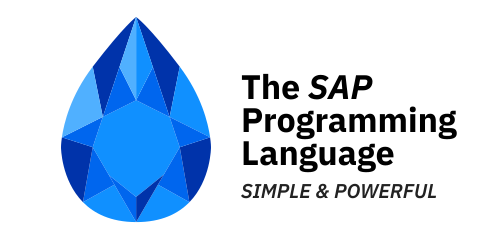

# Sap language

  <picture>
    
  </picture>

[Getting started](../reference/README.md) | [Learn](../tutorial/README.md) | [Documentation](../reference/README.md) | [Contributing](../CONTRIBUTING.md)

> SAP is a short from of `Simple And Powerful`.

> SAP also means `Sapphire`  (you know perl, ruby, crystal, etc.)

SAP Language is a new programming language that is designed to be simple, intuitive, and powerful. It is designed to be a general-purpose language that can be used for a wide range of applications, from simple scripts to complex applications.

- [Language Design](../Design.md)
- [Language Reference](../reference/README.md)

## ZEN of Sap

- `Self-consistency` is better than `contradiction`
- `intuition` is better than `thinking`
- `monotonous` is better than `complexity`
- `structure` is better than `process`
- `logic` is better than `randomness`
- `transparency` is better than `fuzziness`
- `hierarchy` is better than `flatness`
- `distribution` is better than `centralization`

