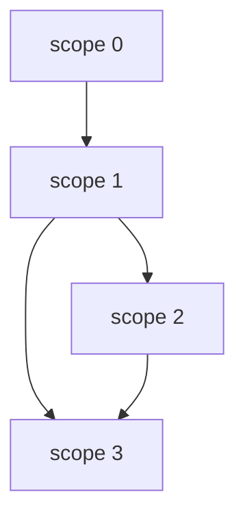

# Error Handling with cofunction


```java
void func() {
    // scope 0
    try {
        // scope 1
    } catch (Exception e) {
        // scope 2
    } finally {
        // scope 3
    }
}
```



you can use `effect` to handle error in sap

# ⚠️Warning⚠️: under construction