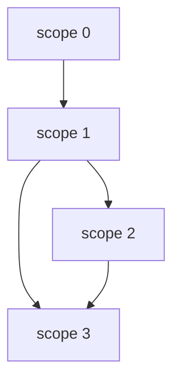

# Error Handling with cofunction


```java
void func() {
    // scope 0
    try {
        // scope 1
    } catch (Exception e) {
        // scope 2
    } finally {
        // scope 3
    }
}
```




```elixir
f = \ -> {
    # scope 0
    
    # due to it is a cofunction, we can return the control flow
    res -> catch = try \ -> {
        # scope 1
    }

    if typeof res == "error" {
        catch \e -> {
            # scope 2
        }
    }

    # finally
    # scope 3
}


```