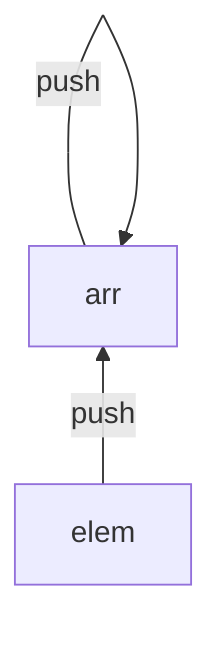
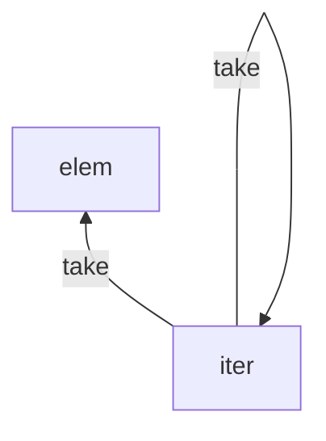
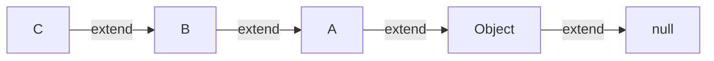
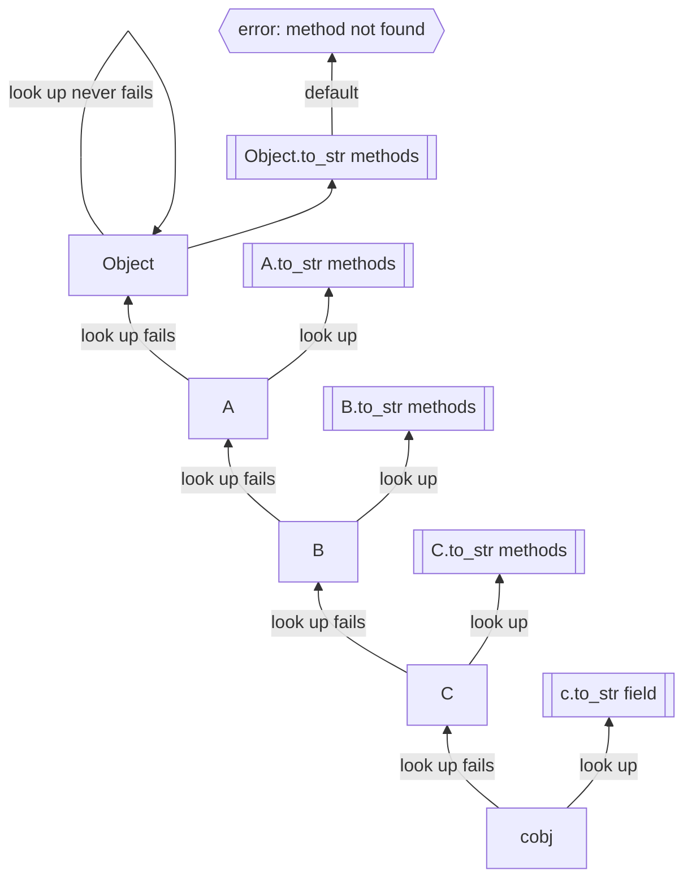

# ⚠️Warning⚠️: under construction

# Object and Method

> for programmer who are new to OOP or just familiar with Simula style OOP (including C++ Java etc), this is a good place to start.

object oriented programming (OOP) is a way to organize the code, and the data and invented by Alan Kay.

the essence of object oriented programming is message passing.

interms of object oriented programming, there are some concepts that we must understand:

- object: which is a coinductive closure of the object constructor.
- method: alias of message handler which is a function binded to the object.
- message: which is a symbol (with some arguments) that is sent to the object.

## Method

method could be defined as a multi-dispatched function that is binded to the object.

```sap
Asteroid   = { clone Object | name: :Asteroid  }
SpaceShip  = { clone Object | name: :SpaceShip }

Asteroid.collide_with ::= \{...| proto.name: :SpaceShip} -> 
    "Ahhhh F***!"

Asteroid.collide_with ::= \{...| proto.name: :Asteroid} -> 
    "hi bro"

SpaceShip.collide_with ::= \{...| proto.name: :Asteroid} ->
    "What was that?"

SpaceShip.collide_with ::= \{...| proto.name: :SpaceShip} ->
    "Boom!!! shaka laka"

a = new Asteroid
s = new SpaceShip
a.collide_with s # "Ahhhh F***!"
a.collide_with a # "hi bro"
s.collide_with a # "What was that?"
s.collide_with s # "Boom!!! shaka laka"
```

## Object

in method section, we have briefly introduced the simplest way to define an object.

as we discussed in the beginning, object is a coinductive closure of the object constructor.

let me explain this in a more detailed way.

coinductive is the `co` in terms of `inductive`, lets first understand what is `inductive`.

I will write a simple example to explain what is `inductive`.

`push` is a function that constructs a `inductive` list.

```sap
push ::= \ null -> []
push ::= \ head arr -> [head | arr]
```



in the above example, we have defined a list data structure, which is a recursive data structure.

`coinductive` is the opposite of `inductive`, the opposite of `push` is `take`.

```sap
take ::= \[] -> null
take ::= \[head | tail] -> head
```



so the data structure which is defined by `take` is a `coinductive` data structure.

> which is just the **iterator** of the list

some people might get the point why we call the object is a `coinductive` closure of the object constructor.

for example for such object C with following extends chain:



finding `to_str` method of object c of C is like:



**if you could not see why object is coinductive check the top part of the flowchart, compare with the take fuction graph**

because the object method resolving process is up-and-right, which is the iterator of how we define the object.

## SOS: Sap Object System

SOS is a object system like `CLOS` in `Common Lisp`, it takes care of both object system and concurrent programming and strongly inspired by erlang's `OTP`.

TODO: write more about SOS

## Reference
- [Multiple Dispatch](https://en.wikipedia.org/wiki/Multiple_dispatch)
- [CLOS](https://en.wikipedia.org/wiki/Common_Lisp_Object_System)
- [OTP](https://en.wikipedia.org/wiki/Open_Telecom_Platform)
- [Object-oriented programming](https://en.wikipedia.org/wiki/Object-oriented_programming)